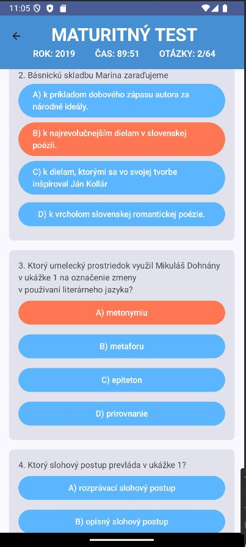
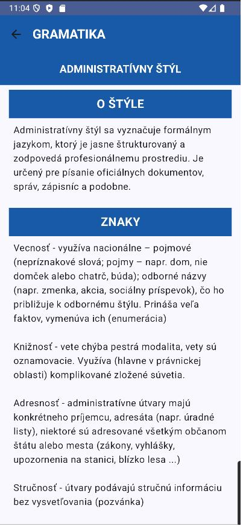

# 🎓 Maturant – High School Graduation Exam Tester  

**Maturant** is a **Kotlin-based Android application** that helps students prepare for their **high school graduation exams**. The app provides an interactive way to practice past and current test questions, simulating real exam conditions.  

## 📌 Features  
- **Interactive test simulation** – Answer multiple-choice and fill-in-the-blank questions.  
- **Automatic grading system** – Get instant feedback on answers.  
- **Customizable timer** – Simulates official exam time constraints.  
- **Study materials** – Covers grammar, literature, and key exam topics.  
- **JSON-based question storage** – Ensures scalability and easy updates.  

## 🛠️ Technologies Used  
- **Kotlin (Android Development)**  
- **Jetpack Compose (UI Framework)**  
- **JSON Parsing (Question Bank Management)**  
- **LiveData & ViewModel (State Management)**
  
## 📸 Screenshots
Here are some screenshots of the APP in action:

  

<h3 align="center">📷 Actual Test</h3>

  

<h3 align="center">🎨 Styles</h3>
